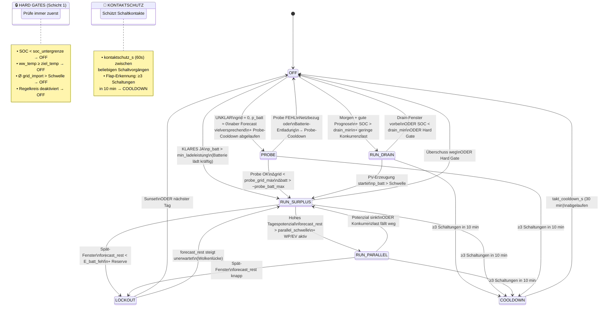

# Heizpatrone V2 — Zustandsbasiertes Steuerkonzept

**Stand:** 2026-03-01  
**Scope:** Schicht C (Automation), Regelkreis `heizpatrone`  
**Ziel:** Überschussstrom robust nutzen, Warmwasserspeicher bis **70°C** laden, dabei am Tagesende Batterie möglichst auf **100% SOC** bringen.

---

## 1. Problemkern (warum ein neuer Ansatz nötig ist)

Die bisherige HP-Logik hat viele Einzelbedingungen, die sich gegenseitig beeinflussen.  
Für eine Nulleinspeiser-Anlage ist außerdem wichtig:

- Gemessene PV-Leistung ist **kein** verlässlicher Überschussindikator (Abregelung verdeckt Potenzial).
- Überschuss muss aus mehreren Signalen erschlossen werden (Batteriefluss, Netzfluss, Forecast, Verbraucher).
- Die Optimierung ist zeitabhängig:
  - morgens ggf. Batterie „anleeren“ (wenn Tag gut wird),
  - mittags Überschüsse breit verteilen (WP+EV+HP parallel),
  - nachmittags Batterie-Füllziel absichern.

Darum wird auf ein **zustandsbasiertes** Konzept umgestellt (State Machine mit klaren Übergängen).

---

## 2. Primärziele und Prioritäten

### 2.1 Optimierungsziele

1. **Warmwasserziel:** Speicher oben auf mindestens **70°C** bringen.
2. **PV-Nutzung:** Abregelverluste minimieren (verdeckte PV-Kapazität aktiv „heben“).
3. **Batterieziel:** Zum Ende der PV-Erzeugung möglichst **100% SOC** erreichen.
4. **Batterieschonung:** Tagsüber bevorzugt bei **SOC_MAX=75% parken**, 100% nur zeitlich kurz vor Tagesende.

### 2.2 Sicherheits- und Schutzpriorität (immer dominant)

- Übertemperatur Speicher → HP sofort AUS.
- Harte SOC-Untergrenze → HP AUS.
- Bei echtem, anhaltendem Netzbezug (nicht nur Transient) → HP AUS.
- Mindestlaufzeit + Mindestpause gegen Takten.

---

## 3. Steuerprinzip: „Nutzbarer Überschuss“ statt „PV-Watt“

Die HP wird nicht auf Roh-PV-Leistung geregelt, sondern auf einen berechneten Wert:

##
`nutzbarer_ueberschuss_w = realer_ueberschuss_w + verdeckter_ueberschuss_w`

### 3.1 Realer Überschuss

Aus aktuellen Messwerten (geglättet über 2–5 min):

- `grid_power_w` (Nulleinspeiser nahe 0)
- `batt_power_w` (>0 Laden, <0 Entladen)
- `house_load_w`, `wp_power_w`, `ev_power_w`

### 3.2 Verdeckter Überschuss (Abregelungs-Indikator)

Wenn `grid_power_w ≈ 0` und Batterie nicht nennenswert lädt, aber Forecast/Geometrie hohes Potenzial anzeigt, ist PV wahrscheinlich abgeregelt.

Indikator (einfach, robust):

- **hoch**, wenn:
  - `forecast_quality in {gut, mittel}`,
  - `forecast_power_profile` für nächste 1–2 h deutlich über aktueller Last,
  - keine starke Wolkenverschlechterung.

Dann darf HP trotz „scheinbar wenig PV“ über **Probe-Impulse** aktiviert werden.

---

## 4. Probe-Mechanik (explizit für Nulleinspeiser)

Neue Kernidee: Überschuss wird aktiv getestet, statt nur passiv geschätzt.

### 4.1 Probeablauf

Wenn HP AUS und Potenzial unklar:

1. HP für `probe_on_s` kurz EIN (z. B. 90–180 s).
2. Beobachte Mittelwerte:
   - `Δgrid_power_w`
   - `Δbatt_power_w`
3. Entscheidung:
   - **Probe erfolgreich**: kaum Netzbezug, Batterie bleibt ladend/neutral → HP in Normalbetrieb übernehmen.
   - **Probe fehlgeschlagen**: spürbarer Netzbezug oder Batterie entlädt stark → HP AUS, Cooldown.

### 4.2 Nutzen

- Erkennt reale Abregelungsreserve ohne Modell-Overfitting.
- Passt sich automatisch an unbekannte Verbraucherzustände an.
- Reduziert Fehlentscheidungen bei wechselhaftem Wetter.

---

## 5. Tagesphasen als State Machine

Die HP-Regel wird auf wenige, klar benannte Zustände reduziert.

##
`OFF` → `PROBE` → `RUN_DRAIN` / `RUN_SURPLUS` / `RUN_PARALLEL` → `LOCKOUT`

### 5.1 Zustände

1. **OFF**  
   HP aus, nur Freigabeprüfung und ggf. Probe.

2. **PROBE**  
   Kurztest zur Erkennung verdeckten Überschusses.

3. **RUN_DRAIN (Morgenfenster)**  
   Ziel: Restenergie aus Batterie nutzen, **nur** wenn Tagesprognose gut und konkurrierende Lasten klein sind.

4. **RUN_SURPLUS (normaler Überschussbetrieb)**  
   HP läuft, solange nutzbarer Überschuss + Sicherheitsbedingungen passen.

5. **RUN_PARALLEL (guter Tag)**  
   Bei hohem Tagespotenzial darf HP parallel zu WP+EV laufen, damit insgesamt mehr PV verwertet wird.

6. **LOCKOUT (Spätnachmittag/Schutz)**  
   HP gesperrt, um Batterie-Endfüllung Richtung 100% zu sichern.

7. **COOLDOWN (Takt-Schutz)**  
   Automation hat Oszillation erkannt (≥ `takt_max_schaltungen` Schaltvorgänge in `takt_fenster_s`).  
   HP wird AUS geschaltet und bleibt `takt_cooldown_s` gesperrt — danach Rückkehr nach OFF.  
   *Hinweis:* Nur automationsbedingte Schaltvorgänge zählen. Externes Schalten → eigene Extern-Respekt-Logik.

### 5.2 Zustandsdiagramm



### 5.3 Transitionstabelle

| Von | Nach | Bedingung | Schicht |
|-----|------|-----------|---------|
| **beliebig** | **OFF** | Hard Gate verletzt (SOC↓, Temp↑, Grid-Import, Regelkreis AUS) | 1 (Gate) |
| **DRAIN/SURPLUS/PARALLEL/PROBE** | **COOLDOWN** | Flap-Erkennung: ≥ `takt_max_schaltungen` in `takt_fenster_s` | Kontaktschutz |
| OFF | RUN_DRAIN | Morgen-Fenster + forecast_quality ≥ mittel + SOC > drain_min + Last gering | 2 |
| OFF | RUN_SURPLUS | **Klares JA:** p_batt > min_ladeleistung (Batterie lädt kräftig) | 2 |
| OFF | PROBE | **Unklar:** grid ≈ 0 ∧ p_batt ≈ 0 ∧ Forecast vielversprechend ∧ Probe-Cooldown abgelaufen | 2 |
| PROBE | RUN_SURPLUS | Nach probe_on_s: Δgrid < probe_grid_max_w ∧ Δbatt > −probe_batt_discharge_max_w | 2 |
| PROBE | OFF | Probe fehlgeschlagen → Probe-Cooldown probe_cooldown_s | 2 |
| DRAIN | OFF | Fenster vorbei ∨ SOC < drain_min ∨ Hard Gate | 1+2 |
| DRAIN | RUN_SURPLUS | PV-Erzeugung setzt ein, p_batt > Schwelle | 2 |
| SURPLUS | RUN_PARALLEL | forecast_rest > parallel_ab_forecast_kwh ∧ (WP ∨ EV aktiv) | 2 |
| SURPLUS | OFF | Überschuss verschwindet (p_batt sinkt + grid steigt) | 2 |
| SURPLUS | LOCKOUT | h_rest < late_lockout_rest_h ∧ forecast_rest < E_batt_fehl + Reserve | 2 |
| PARALLEL | SURPLUS | Potenzial sinkt ∨ WP+EV aus | 2 |
| PARALLEL | LOCKOUT | Spät-Fenster + Restprognose knapp | 2 |
| LOCKOUT | OFF | Nach Sunset / neuer Tag | 2 |
| LOCKOUT | SURPLUS | Unerwartet gute Einstrahlung → forecast_rest steigt deutlich | 2 |
| COOLDOWN | OFF | `takt_cooldown_s` abgelaufen | Kontaktschutz |

### 5.4 Schutzebenen für Schaltkontakte

Die Automation unterscheidet drei Schutzebenen:

| Ebene | Was | Auslöser | Dauer |
|-------|-----|----------|-------|
| **Kontaktschutz** | Minimale Totzeit zwischen beliebigen Schaltvorgängen | Jeder Schaltbefehl | `kontaktschutz_s` (60s) |
| **Flap-Erkennung** | Oszillation erkannt → COOLDOWN | ≥ `takt_max_schaltungen` (3) in `takt_fenster_s` (600s) | `takt_cooldown_s` (1800s) |
| **Extern-Respekt** | Externes EIN erkannt → Automation greift nicht ein | Manuelles Schalten | `extern_respekt_s` (3600s) |

**Wichtig:** Nur automationsbedingte Schaltvorgänge zählen für die Flap-Erkennung.  
Externes Schalten löst stattdessen den Extern-Respekt-Timer aus.

**Implementierung:** Ringpuffer `deque(maxlen=5)` mit Timestamps. Bei jedem `hp_ein`/`hp_aus`:
- Timestamp eintragen
- Prüfe: Sind ≥ 3 Einträge jünger als 10 min? → COOLDOWN

### 5.5 Entscheidungsreihenfolge pro Zyklus (1 min)

```
1. Hard Gates prüfen
   └─ verletzt? → Zustand := OFF, return hp_aus

2. Kontaktschutz / Flap-Erkennung
   ├─ Letzte Schaltung < kontaktschutz_s? → blockiert (aktuellen Zustand halten)
   └─ ≥3 Schaltungen in takt_fenster_s? → Zustand := COOLDOWN, return hp_aus

3. Extern-Respekt
   └─ HP extern eingeschaltet? → Timer starten, nicht eingreifen

4. Aktuellen Zustand auswerten
   ├─ OFF:      Prüfe Drain / Klares-JA / Probe-Trigger
   ├─ PROBE:    Warte probe_on_s, dann Δ-Auswertung
   ├─ RUN_*:    Prüfe Überschuss-Fortbestand, Lockout-Schwelle
   ├─ LOCKOUT:  Prüfe Sunset / Überraschungs-Überschuss
   └─ COOLDOWN: Prüfe takt_cooldown_s abgelaufen?

5. Zustandsübergang durchführen + loggen
   └─ state_from, state_to, grund
```

---

## 6. Entscheidungslogik je Tagesfenster

### 6.1 Morgen (Sunrise bis ca. 10:00) — optionales Drain

HP darf laufen, wenn alle Bedingungen erfüllt sind:

- Speicher `< 70°C`
- `forecast_quality` mindestens mittel
- ausreichend Restenergie (`forecast_rest_kwh` über Schwellwert)
- niedrige Konkurrenzlast (`wp_power_w`, `ev_power_w`, `house_load_w` unter Grenzen)
- SOC über Drain-Mindestgrenze

Interpretation: Morgens darf HP „vorgezogen“ laufen, **wenn** klar ist, dass Batterie später wieder sicher geladen wird.

### 6.2 Vormittag/Mittag — aktive Überschussnutzung

- Primärzustand `RUN_SURPLUS`.
- Bei unklarem Potenzial zuerst `PROBE`.
- Bei hoher Tagesprognose Wechsel nach `RUN_PARALLEL`: WP+EV+HP gleichzeitig zulassen.

Interpretation: Auf guten Tagen ist Parallelbetrieb vorteilhaft, weil sonst Abregelung verschenkt wird.

### 6.3 Nachmittag bis PV-Ende — Batterie-Endziel absichern

- Dynamische Prüfung: Reicht `forecast_rest_kwh`, um
  1) Batterie bis Ziel-SOC und
  2) Rest-HP-Laufzeit
  zu decken?
- Wenn nein → `LOCKOUT`.

Empfehlung:

- bis frühem Nachmittag SOC bei 75% parken (Schonung),
- ab „Lade-Deadline“ SOC_MAX auf 100% öffnen,
- HP nur noch, wenn Restprognose dies **explizit** zulässt.

---

## 7. Zielgrößen und Formeln (einfach, transparent)

### 7.1 Fehlende Batterieenergie

$$
E_{batt,fehl} = \max(0, SOC_{ziel} - SOC_{aktuell}) \cdot C_{batt}
$$

mit $C_{batt}=10{,}24\,\text{kWh}$.

### 7.2 Freigabe für HP im Spätfenster

HP nur erlaubt, wenn:

$$
forecast\_rest\_kwh \ge E_{batt,fehl} + E_{hp,reserve} + E_{sicher}
$$

- `E_hp,reserve`: geplante HP-Energie (z. B. 0.5–1.5 kWh)
- `E_sicher`: Sicherheitsaufschlag für Prognosefehler

### 7.3 Prognosevertrauen (Quality-Faktor)

`confidence ∈ [0,1]` aus Forecast-Qualität + IST/SOLL-Abgleich.  
Bei geringer Confidence:

- kürzere Laufzeiten,
- strengere Freigabeschwellen,
- schnellere Rückkehr in `OFF/LOCKOUT`.

---

## 8. Parameterstruktur V2 (empfohlen)

Neuer Block in `regelkreise.heizpatrone.parameter`:

- `ziel_temp_c` (Default 70)
- `probe_on_s`, `probe_cooldown_s`, `probe_grid_max_w`, `probe_batt_discharge_max_w`
- `drain_fenster_ende_h`, `drain_min_soc_pct`, `drain_max_house_w`, `drain_min_forecast_kwh`
- `parallel_ab_forecast_kwh`, `parallel_wp_allow`, `parallel_ev_allow`
- `late_lockout_rest_h`, `late_reserve_kwh`, `late_safety_kwh`
- `soc_target_end_pct` (Default 100), `soc_park_pct` (Default 75), `soc_open_deadline_h`
- `min_laufzeit_s`
- `kontaktschutz_s` (Default 60) — harter Floor zwischen zwei Schaltbefehlen
- `takt_fenster_s` (Default 600) — Beobachtungsfenster für Flap-Erkennung
- `takt_max_schaltungen` (Default 3) — Schwelle für Flap → COOLDOWN
- `takt_cooldown_s` (Default 1800) — Wartezeit im COOLDOWN-Zustand
- `extern_respekt_s` (Default 3600) — Wartezeit nach externem Schalten

Bestehende Parameter können schrittweise auf diese Struktur gemappt werden.

**Entfallen:** `min_pause_s` — ersetzt durch die dreistufige Schutzlogik (Kontaktschutz + Flap-Erkennung + Extern-Respekt).

---

## 9. Integrationsvorschlag in bestehende Engine

### 9.1 Minimal-invasive Umsetzung

1. `RegelHeizpatrone` intern auf Zustandsautomat umbauen (gleiche Aktor-Schnittstelle behalten).
2. Bestehende Notaus-Regeln als „Guard Layer“ unverändert voranstellen.
3. Neue Probe-Mechanik als eigener Zustand (`PROBE`) einbauen.
4. Entscheidung und State-Übergänge im Log explizit ausgeben (`state_from`, `state_to`, Grund).

### 9.2 Beobachtungsdaten (bereits vorhanden)

Nutzbar ohne neue Hardware:

- `batt_power_w`, `batt_soc_pct`, `soc_max`
- `grid_power_w`, `pv_total_w`, `house_load_w`
- `wp_power_w`, `ev_power_w`
- `forecast_rest_kwh`, `forecast_kwh`, `forecast_quality`, `forecast_power_profile`
- `ww_temp_c`, `sunset`

---

## 10. Konkrete Betriebsstrategie für eure Anforderungen

1. **Speicherziel 70°C** als Standard-Soll für HP.
2. **Morgens Drain erlauben**, aber nur bei guter Prognose und niedriger Konkurrenzlast.
3. **Gute Tage aktiv parallelisieren** (WP+EV+HP), damit Abregelung sinkt.
4. **Nachmittags strikt energiebasiert entscheiden**: Batterie-Endziel priorisieren.
5. **75%-Parken beibehalten**, Öffnung auf 100% zeitgesteuert vor PV-Ende.
6. **Probe-Modus als Pflicht bei Unsicherheit**, statt starrem „PV-Überschuss > X“.

---

## 11. Rollout in 3 Schritten

### Schritt 1 — Transparenz

- Nur State-Entscheidung + Probe-Simulation loggen, noch ohne Schaltwirkung.
- 3–7 Tage Vergleich: „wäre geschaltet“ vs. reale Lage.

### Schritt 2 — Kontrollierter Betrieb

- Probe + RUN_SURPLUS aktivieren.
- RUN_PARALLEL zunächst nur bei sehr guter Prognose freigeben.

### Schritt 3 — Vollbetrieb

- RUN_PARALLEL dynamisch nach Confidence.
- Parameter feinjustieren (insb. `late_safety_kwh`, `probe_*`).

---

## 12. Erfolgsmetriken

- Anteil Zeit mit Speicher `>=70°C`.
- Zusätzliche HP-kWh aus PV (ohne Netzbezug).
- Abregelungsindikator vor/nach V2 (Proxy: Zeiten mit `grid≈0` + hoher Forecast + niedriger Last).
- Batterie-SOC bei PV-Ende (Median, P10).
- Anzahl HP-Schaltspiele pro Tag (Taktungskontrolle).

Dieses Konzept reduziert Komplexität, weil die Entscheidung nicht mehr aus vielen verschachtelten Sonderfällen besteht, sondern aus wenigen Zuständen mit klaren Übergangsregeln.