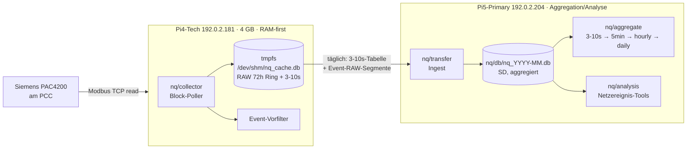

# NQ-Modul (Rolle N) — PAC4200-Netzqualität Tech + Primary

**Stand:** 2026-07-11
**Rolle:** N (Netzqualität) — siehe [`../system/ABCDEN_ROLLENMODELL.md`](../system/ABCDEN_ROLLENMODELL.md)
**Status:** Architektur festgelegt, Implementierung in Phasen (siehe unten)

---

## 1. Abgrenzung: `nq/` (neu) vs. `netzqualitaet/` (Legacy)

| Aspekt | `netzqualitaet/` (Legacy, Rolle B) | `nq/` (neu, Rolle N) |
|---|---|---|
| Quelle | Fronius Smart Meter aus Produktions-`raw_data` (3 s) | dediziertes **Siemens PAC4200** am PCC (Modbus TCP) |
| Zweck | Ableitung NQ aus vorhandenen Bilanzdaten | Vollerfassung Netzbeschaffenheit inkl. THD/Harmonische |
| Schreibpfad | eigene Monats-DBs (`nq/legacy/db/`) | eigene NQ-DBs (`nq/db/`, tmpfs auf Tech) |
| Host | Primary (read-only Web/API) | **Tech** (Collector) + **Primary** (Aggregation/Analyse) |

Beide bleiben bestehen. Das Legacy-Modul liefert weiter die Web-/DFD-Ansicht aus
Bilanzdaten; das neue `nq/`-Modul ergänzt eine echte PQ-Messkette. Keine
Vermischung der Schemata.

---

## 2. Zwei-Host-Architektur



**Grundprinzipien (aus den No-Gos abgeleitet):**

- **Tech arbeitet RAM-first.** Nutzdaten liegen im `tmpfs`; die SD-Karte wird für
  NQ **nicht** dauerhaft beschrieben (nur seltene, optionale Notsicherung).
- **Primary hält die dauerhafte, aggregierte NQ-DB** auf SD — sparsam, weil nur
  Aggregate + Event-RAW ankommen, nicht der volle RAW-Strom.
- **Read-only gegenüber Produktion.** Kein Schreibpfad in `data.db` oder Aktoren.

---

## 3. RAM-Budget-Entscheidung (Tech, 4 GB)

### 3.1 Randbedingungen

Pi4-Tech hat **4 GB RAM**. Darauf laufen Debian 13, die WP/HW-Bridge (RS485,
`WP_BACKEND_MODE=local`) und künftig der NQ-Collector. Reserviert für
OS + Bridge + Collector-Prozess + Page-Cache: **~2 GB**. Damit steht ein
**tmpfs von 1,5 GB** sicher zur Verfügung (bewährt aus der Pi5-Vorlage, hier
konservativer wegen der schwächeren Pi4-Plattform).

> **Verifiziert (2026-07-11):** `MemTotal` = 3 887 804 kB (≈ 3,71 GiB nutzbar,
> 4 GB nominal, Pi 4 Model B Rev 1.5). Grundlast im Leerlauf ~0,4 GB benutzt,
> ~3,3 GiB verfügbar; `/dev/shm` mit 1,9 GB gemountet. Das 1,5-GB-tmpfs-Budget
> (Kappung bei 1,2 GB) ist damit bestätigt und lässt selbst mit laufender
> WP-Bridge klare Reserve.

### 3.2 Datenvolumen je Poll-Profil (aus [`PAC4200_PI5_ENTSCHEIDUNGSVORLAGE.md`](PAC4200_PI5_ENTSCHEIDUNGSVORLAGE.md))

| Profil | Fast / Medium / Slow | Brutto pro Tag (inkl. SQLite-Overhead) |
|---|---|---|
| 1 Maximal | 500 ms / 1 s / 1 s | ~550 MB/Tag |
| **2 Balanciert (gewählt)** | **500 ms / 1 s / 5 s** | **~180 MB/Tag** |
| 3 Konservativ | 1 s / 5 s / 10 s | ~90 MB/Tag |

### 3.3 Entscheidung: 72 h (3 Tage) RAW im tmpfs

Bei **Profil 2 (balanciert)**:

$$ 3\ \text{Tage} \times 180\ \text{MB/Tag} = 540\ \text{MB} $$

Das sind **~36 %** des 1,5-GB-tmpfs. Zusammen mit der 3–10 s-Aggregattabelle,
Event-RAW-Markierungen, Indizes und WAL bleibt die Belegung deutlich unter
**~1,0 GB** — mit klarer Sicherheitsreserve zum tmpfs-Limit und zum
Gesamt-RAM des Pi4.

**Festlegung:**

- **`NQ_RAW_RETENTION_H = 72`** (3 Tage RAW im tmpfs; deckt exakt die
  „72 h-Basis" der feinsten Aggregatstufe ab).
- **`NQ_TMPFS_BUDGET_MB = 1500`**, harte Kappung greift bereits bei
  **`NQ_TMPFS_CAP_MB = 1200`** (Ring-Buffer, s. §5).
- Poll-Default = **Profil 2**; die Slow-Block-Rate wird nach dem **48 h-Feldtest**
  (§7) auf die reale interne Refresh-Rate des PAC4200 nachgezogen.

> Selbst bei versehentlichem Profil 1 (550 MB/Tag) blieben 3 Tage = 1,65 GB
> unter dem Gesamt-RAM; die Kappung bei 1,2 GB verhindert ein tmpfs-Überlaufen
> in jedem Fall.

---

## 4. Collector-DB auf Tech — Blöcke & Tabellen

Der Collector trennt nach **realer Aktualisierungskadenz** des PAC4200. Alle
vom Gerät gelieferten Größen werden erfasst (nichts wird weggeworfen), aber je
Block mit eigener Poll-Rate und eigener Tabelle.

| Block | Inhalt | Werte | Poll-Default | Tabelle (tmpfs) |
|---|---|---|---|---|
| **Fast** | RMS U je Phase, I je Phase, P/Q/S, cos φ, f | ~20 | 500 ms | `nq_raw_fast` |
| **Medium** | THD U je Phase, THD I je Phase, ggf. Unsymmetrie | ~6–9 | 1 s | `nq_raw_medium` |
| **Slow** | Harmonische 2..64 (U + I, je Phase) | 378 | 5 s | `nq_raw_slow` |
| **Aggregat** | min/avg/max je Größe auf 3–10 s-Raster | alle | abgeleitet | `nq_agg_10s` |

- PK jeweils `ts` (Unix-Sekunden, ms-Anteil bei Fast als separate Spalte oder
  Sub-Sekunden-`ts_ms`).
- Schema-Quelle: [`../../nq/schema/nq_tech_schema.sql`](../../nq/schema/nq_tech_schema.sql).
- Schreibmuster **analog Produktion**: `deque`-RAM-Buffer + Batch-`executemany`
  (Vorbild [`collector/buffer.py`](../../collector/buffer.py)), WAL,
  `synchronous=NORMAL`, kurzer Lock-Timeout.

> **Wichtig:** Die konkreten PAC4200-Registeradressen sind **nicht** frei
> erfunden zu übernehmen. Sie stammen aus der verifizierten Siemens-Modbus-Doku
> und werden im Feldtest bestätigt (siehe [`MESSTECHNIK.md`](MESSTECHNIK.md)).

---

## 5. Kappungs-Mechanik (Ring-Buffer)

Damit der tmpfs nie überläuft, greifen **zwei** Sicherungen:

1. **Zeit-Ring:** periodischer `DELETE FROM nq_raw_* WHERE ts < now-72h`
   (bzw. Event-RAW ausgenommen — markierte Segmente bleiben bis zum
   bestätigten Transfer).
2. **Größen-Kappung:** vor jedem Flush prüft der Collector die tmpfs-Belegung
   (`os.statvfs` bzw. DB-`page_count`). Übersteigt sie `NQ_TMPFS_CAP_MB`,
   werden die ältesten Nicht-Event-Zeilen blockweise gelöscht, bis wieder
   Reserve besteht. Danach `PRAGMA wal_checkpoint(TRUNCATE)` +
   `PRAGMA optimize` (kein `VACUUM` im heißen Pfad).

Die Kappung protokolliert in `nq_capping_log` (wieviel gelöscht, Auslöser),
damit Datenlücken auditierbar bleiben (analog „echte Lücken sichtbar lassen").

---

## 6. Übernahme nach Primary + Aggregationskaskade

### 6.1 Transfer (täglich, 1×)

- Tech exportiert **nur**: (a) die `nq_agg_10s`-Tabelle des Vortags und
  (b) die als **Event** markierten RAW-Segmente (`nq_raw_*` mit Event-Flag).
- Transport über LAN (Batch klein: ~1–2 MB/Tag für Aggregat, Events selten).
- Löschung aus dem tmpfs **erst nach quittiertem Transfer** (At-least-once).
- SD-Schonung: Non-Event-RAW verlässt Tech nie und landet nie auf SD.

### 6.2 Aggregationskaskade auf Primary (Vorbild Produktions-Pipeline)

```
nq_agg_10s (3–10 s, 72 h auf Primary)         ← Transfer von Tech
   ↓ nq/aggregate  (täglich)
nq_5min      (Retention ~90 d)
   ↓
nq_hourly    (Retention ~365 d)
   ↓
nq_daily     (Retention ~10 a)  + nq_events (Event-RAW-Verweise)
```

- Jede Stufe min/avg/max je Größe (plus std/spread wo sinnvoll, s. `METHODEN.md`).
- Schema-Quelle: [`../../nq/schema/nq_primary_schema.sql`](../../nq/schema/nq_primary_schema.sql).
- Cron-gestaffelt wie die Produktions-Aggregate (min1→fifteen→daily …).
- **Event-RAW** wird als echte RAW-Auflösung gespeichert (nicht aggregiert),
  damit Transienten rekonstruierbar bleiben.

---

## 7. Feldtest-Vorbedingung (Phase 0)

Vor finalem Produktions-Code steht der **48 h-Read-Only-Feldtest** (aus der
Entscheidungsvorlage): Ein kleines Skript pollt Profil 1 und **druckt nur
Deltas**, speichert nichts. Erkenntnisziel: Wie oft aktualisiert der PAC4200
intern RMS-/THD-/Harmonik-Register real? Die gemessenen Refresh-Zeiten legen die
endgültigen Poll-Raten fest (dichter zu pollen erzeugt nur redundante Reads).

### 7.1 Erste Messergebnisse (Kurzlauf 2026-07-11, 250 ms)

Gegen das reale Gerät (`192.0.2.111`) bereits bestätigt (Details in
[`MESSTECHNIK.md`](MESSTECHNIK.md)):

- **RMS / Leistung / PF / THD-U:** interne Aktualisierung **≤ 250 ms** → Fast-Block
  bei 500 ms unkritisch (250 ms optional möglich).
- **Frequenz (Reg. 55):** refresht nur **~alle 10 s** → gehört in einen langsamen
  Takt, nicht in den Fast-Block.
- **THD-I (Reg. 49–53):** derzeit **NaN** → als „nicht verfügbar" behandeln.
- **Harmonische 2..64:** Modbus-Adressen noch offen (Voll-Feldtest).

Eine **read-only Live-Anzeige** der verifizierten Werte existiert bereits unter
`/pac4200` (Flow → Maschinenraum → PAC4200), Code [`../../routes/pac4200.py`](../../routes/pac4200.py)
+ [`../../nq/pac_live.py`](../../nq/pac_live.py) (Rolle-B-Anzeige über read-only
Modbus, analog `FroniusReadOnly`).

---

## 8. Analysetools (Netzereignisse)

Ziel: belastbare Aussagen zu drei Ebenen (Details siehe
[`METHODEN.md`](METHODEN.md) und die Analyse-Card):

- **Lokal / hochfrequent (HF):** THD- und Harmonik-Auffälligkeiten, kurze
  Spannungs-/Strom-Transienten, Korrelation U↔I_lokal (lokale Rückwirkung vs.
  netzseitig), Schleifenimpedanz-basierte Spannungsbereinigung.
- **Global / niederfrequent (NF):** Frequenz- und RMS-Muster im s–min-Bereich,
  DFD an 15-min-Handelsgrenzen, Nadir/Gradienten.
- **Sehr niederfrequent (VLF):** Tages-/Wochen-/Saisonprofile, langsame Drift
  von U/f/THD, Changepoints, Kalenderprofile.

### 8a. Sauberer Musteranalyse-Datensatz (`nq_pattern_5min`)

Für die eigentliche Netz-Musteranalyse (Aufschwingen im europäischen Netz,
Reflexionen an Netzgrenzen, LF-Schwingungspakete) muss das **interne** Signal
(hinter dem Netzanschlusspunkt: Lastsprünge, PF/U/S/Q-Änderungen) entfernt sein.

[`nq/analysis/nq_pattern.py`](../../nq/analysis/nq_pattern.py) erzeugt daraus den
**permanenten, bereinigten** Datensatz `nq_pattern_5min` (Primary-SD) aus `nq_5min`.
Wissenschaftliche Methode = **Residual-/Deconvolution-Filter** (Ohmsches Gesetz +
Superposition, Standard-Netzspannungsabfall-Formel):

```
ΔU_intern_Lx = I_Lx · (R·cosφ_Lx + X·sinφ_Lx)
U_grid_Lx    = U_gemessen_Lx + ΔU_intern_Lx        (interner IR-Abfall zurück-addiert)
```

mit der gemessenen Schleifenimpedanz Z=R+jX aus [`config/nq_impedance.json`](../../config/nq_impedance.json).
Ergebnis-Spalten: netzseitige `u_clean_lx`, Referenz `u_meas_lx`, `freq` (systemweit,
keine Korrektur), `pf_lx`, `phi_lx`, Referenz `i_lx`, `du_int_max`, `origin`
(`intern`/`extern` je Bucket-Dominanz). Rohdaten (`nq_5min`) bleiben unverändert.

- Rückwirkend: `python3 -m nq.analysis.nq_pattern --from … --to …` (einmalig aus PAC-Daten).
- Laufend: `nq_events.analyze_day` triggert `nq_pattern.build_day` (täglich, best-effort).
- Read-only-API: `/api/nq/pattern?day=YYYY-MM-DD` (oder `start=&end=`).
- **Offen (Ausbau):** ggf. THD/Harmonik + `df/dt` als weitere Musteranalyse-Größen
  ergänzen; Frontend `nq_analyse_view.html` auf diesen Datensatz mit Zeitkontext umstellen.

---

## 9. Implementierungsphasen (eigene Chats)

| Phase | Inhalt | Host | Prompt |
|---|---|---|---|
| **0** | Read-only-Feldtest, Refresh-Raten messen | Tech | `.github/prompts/nq-0-fieldtest.prompt.md` |
| **1** | Tech-Collector (PAC-Client, Block-Poller, tmpfs-DB, Kappung) | Tech | `.github/prompts/nq-1-tech-collector.prompt.md` |
| **2** | Transfer + Aggregationskaskade | Tech+Primary | `.github/prompts/nq-2-transfer-aggregation.prompt.md` |
| **3** | Analysetools (HF/NF/VLF) | Primary | `.github/prompts/nq-3-analysis-tools.prompt.md` |

Jede Phase pflegt die zugehörige Card in `doc/llm/cards/` (Pre-commit-Pflicht)
und aktualisiert dieses Dokument bei Abweichungen.

---

## 10. Verweise

- [`../system/ABCDEN_ROLLENMODELL.md`](../system/ABCDEN_ROLLENMODELL.md) — Rolle N
- [`README.md`](README.md) — NQ-Gesamtübersicht (Legacy + neu)
- [`MESSTECHNIK.md`](MESSTECHNIK.md) — PAC4200-Fakten, Registerblöcke
- [`PAC4200_PI5_ENTSCHEIDUNGSVORLAGE.md`](PAC4200_PI5_ENTSCHEIDUNGSVORLAGE.md) — Datenmengen-Rechnung
- [`METHODEN.md`](METHODEN.md) — Analyseverfahren
- [`../../nq/README.md`](../../nq/README.md) — Code-Paket
